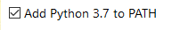

Creating documentation
======================

.. contents::

To get started with contributing to the Achilles Lexicon, we have to do some first steps in case you don't have the tools.

1. Installation
---------------

.. note::
    If you have any of these already installed then you can skip that step.

1.1. Python 3
^^^^^^^^^^^^^

To get started, we need to install Python 3.
Dowload the latest version of Python `at the Python website <https://www.python.org/downloads/>`_.

**When installing Python, remember to check** *Add Python 3.x to PATH*

Choose the default install option - *Install Now*

.. image:: docs-images/1.png
    :alt: Python installer

1.2. Git Bash
^^^^^^^^^^^^^

To get the documentation and later save your changes and upload them to GitHub, we need Git.

To download Git, go to the `Git project website <https://git-scm.com/downloads>`_.

Follow the default installer options and you should be fine.

1.3. Sphinx
^^^^^^^^^^^

To install Sphinx open Git Bash and run the following command:
::

    pip install sphinx

1.4. Make
^^^^^^^^^

We use Make for easy building of documentation which can also be used to display any errors.

Download Make from `here <http://gnuwin32.sourceforge.net/downlinks/make.php>`_. Install it following all the defaults.

Once installed, you should add the Make directory path to the :code:`PATH` system variable.

1.4.1. Adding Make to the :code:`PATH` variable
"""""""""""""""""""""""""""""""""""""""""""""""

1. Find the Edit the system environment variables in Control Panel or in Search for Windwos 10 machines.

.. image:: docs-images/3.png
    :alt: Edit the system environment variables

2. Click on the environment variables button.

.. image:: docs-images/4.png
    :alt: Environment variables

3. Find the Path variable under the System variables and press Edit.

.. image:: docs-images/5.png
    :alt: Path under system variables

4. Press New and enter the installation directory of Make and add :code:`bin` to the path and save.
::

    C:\Program Files (x86)\GnuWin32\bin\

.. image:: docs-images/6.png
    :alt: Add Make install directory to Path

5. After this you should be able to run :code:`make` in Git Bash and you should see the following:
::

    make
    make: *** No targets specified and no makefile found.  Stop.

.. note::
    If you run the :code:`make` command in Git Bash and see the following:
    ::

        make
        bash: make: command not found

    Restart all open Git Bash'es to refresh the loaded :code:`PATH` variable. 

2. Editor set up
----------------

2.1. Visual Studio Code
^^^^^^^^^^^^^^^^^^^^^^^

If you are using Visual Studio Code, we recommend using the following extensions to provide a better documentation experience.

- `reStructuredText <https://marketplace.visualstudio.com/items?itemName=lextudio.restructuredtext>`_ for editing restructured text and having a preview in-editor.

3. Cloning the repository
-------------------------

.. tip::
    To quickly open up the directory you want in Git Bash, you can use the context menu (Right Mouse Button) in Windows Explorer and click :code:`Git Bash Here`.

To get Achilles, you need to **fork** Achilles and open up Git Bash and run the following commands:
::

    git clone https://github.com/YourUserNameHere/Achilles/
    cd Achilles/
    git checkout rewrite
    git checkout -b aMeaningfulBranchNameHere

4. Building documentation
-------------------------

To build documentation locally and to test for errors, run the following in Git Bash:
::

    cd docs/
    make html

If documentation was built without warnings and errors, then you can create a commit and push to GitHub:
::

    git add .
    git commit -m "Enter a meaningful commit message here"
    git push origin aMeaningfulBranchNameHere

Afterwards, go into GitHub and create a `pull request <https://help.github.com/en/articles/creating-a-pull-request-from-a-fork>`_.

5. Restructured Text cheat sheet
--------------------------------

.. note::
    Fill out this sub-section with rst examples and doc usage.