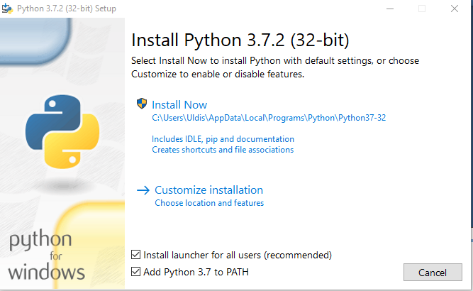
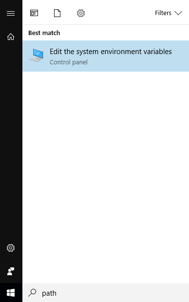
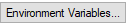
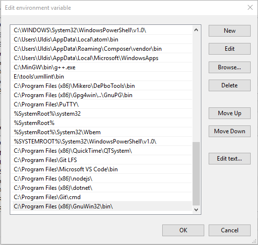

Creating documentation
======================

.. contents::

To get started with contributing to the Achilles Lexicon, we have to do some first steps in case you don't have the tools or if you do, then you can jump right in, but before so, get acquainted with the guidelines we follow.

1. Installation
---------------

.. note::
    If you have any of these already installed then you can skip that step.

1.1. Python 3
^^^^^^^^^^^^^

To get started, we need to install Python 3.
Dowload the latest version of Python `at the Python website <https://www.python.org/downloads/>`_.

**When installing Python, remember to check** *Add Python 3.x to PATH*

.. image:: docs-images/2.png
    :alt: Add Python to PATH

Choose the default install option - *Install Now*

1.2. Git Bash
^^^^^^^^^^^^^

To get the documentation and later save your changes and upload them to GitHub, we need Git.

To download Git, go to the `Git project website <https://git-scm.com/downloads>`_.

Follow the default installer options and you should be fine.

1.3. Sphinx
^^^^^^^^^^^

To install Sphinx open Git Bash and run the following command:
::

    pip install sphinx

.. tip::
    If running the above command, you experience and error: try running Git Bash as administrator.

1.4. Make
^^^^^^^^^

We use Make for easy building of documentation which can also be used to display any errors.

Download Make from `here <http://gnuwin32.sourceforge.net/downlinks/make.php>`_. Install it following all the defaults.

Once installed, you should add the Make directory path to the :code:`PATH` system variable.

1.4.1. Adding Make to the :code:`PATH` variable
"""""""""""""""""""""""""""""""""""""""""""""""

1. Find the Edit the system environment variables in Control Panel or in Search for Windwos 10 machines.

2. Click on the environment variables button.

3. Find the Path variable under the System variables and press Edit.

4. Press New and enter the installation directory of Make and add :code:`bin` to the path and save.
::

    C:\Program Files (x86)\GnuWin32\bin\

5. After this you should be able to run :code:`make` in Git Bash and you should see the following:
::

    make
    make: *** No targets specified and no makefile found.  Stop.

.. note::
    If you run the :code:`make` command in Git Bash and see the following:
    ::

        make
        bash: make: command not found

    Restart all open Git Bash'es to refresh the loaded :code:`PATH` variable.

2. Editor set up
----------------

2.1. Visual Studio Code
^^^^^^^^^^^^^^^^^^^^^^^

If you are using Visual Studio Code, we recommend using the following extensions to provide a better documentation experience.

- `reStructuredText <https://marketplace.visualstudio.com/items?itemName=lextudio.restructuredtext>`_ for editing restructured text and having a preview in-editor.

3. Cloning the repository
-------------------------

.. tip::
    To quickly open up the directory you want in Git Bash, you can use the context menu (Right Mouse Button) in Windows Explorer and click :code:`Git Bash Here`.

To get Achilles, you need to **fork** Achilles and open up Git Bash and run the following commands:
::

    git clone https://github.com/YourUserNameHere/Achilles/
    cd Achilles/
    git checkout rewrite
    git checkout -b aMeaningfulBranchNameHere

4. Building documentation
-------------------------

To build documentation locally and to test for errors, run the following in Git Bash:
::

    cd docs/
    make html

If documentation was built without warnings and errors, then you can create a commit and push to GitHub:
::

    git add .
    git commit -m "Enter a meaningful commit message here"
    git push origin aMeaningfulBranchNameHere

Afterwards, go into GitHub and create a `pull request <https://help.github.com/en/articles/creating-a-pull-request-from-a-fork>`_.

5. Documentation guidelines
---------------------------

5.1. Table of contents
^^^^^^^^^^^^^^^^^^^^^^

Each page should have a table of contents, which is a restructured text directive called :code:`.. contents::`.

5.2. Numbering system
^^^^^^^^^^^^^^^^^^^^^

All pages must contain numbered headings with the format: :code:`x.x.x.`.

.. note::
    Note the last dot after all the numbers.

The deepest level you can go into is 3 levels deep (:code:`x.x.x.`).

.. highlight:: rst

5.3. Headings
^^^^^^^^^^^^^

Headings are formatted as follows:
::

    Page title (section) (will be displayed in the left sidebar)
    ============================================================

    Typically, here you would insert the table of contents.

    1. Subsection
    -------------

    This is a subsection.

    1.1. Subsubsection
    ^^^^^^^^^^^^^^^^^^

    This is a subsubsection.

    1.1.1. Paragraph
    """"""""""""""""

    This is a paragraph.

    1.1.2. Another paragraph
    """"""""""""""""""""""""

    This is another paragraph.

    2. Different subsection
    -----------------------

    This is a completely different subsection.

.. warning::
    Notation under headings are to be the exact length as the title, otherwise it is considered a error.

5.5. Naming
^^^^^^^^^^^

All pages, sections, subsections, etc. are to have a meaningful name and should closely represent the actual content under the heading.

Page titles should not start with numbers unless absolutely necessary.

Headings should avoid using complicated names that would be difficult to understand by inexperienced users.

Headings are to be short and concise without being overly long to prevent issues on mobile devices.

Headings are to start with a capital letter but then follow **lowercase**.

.. note::
    In case there is an acronym (should be avoided), a name or anything else that should start with a capital letter, then it is to be considered an exception to the naming rule above.

5.5. Images
^^^^^^^^^^^

To declutter the directory structure, images should be in separate directories, where only images are stored for only one page.

6. Restructured text cheat sheet
--------------------------------

A useful and more comprehensive cheat sheet for restructured text can be found on `Thomas Cokelaer's <https://thomas-cokelaer.info/tutorials/sphinx/rest_syntax.html>`_ website.
