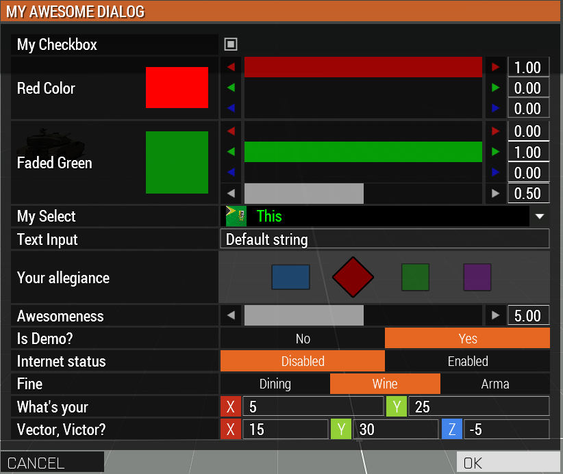
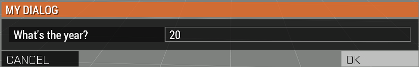
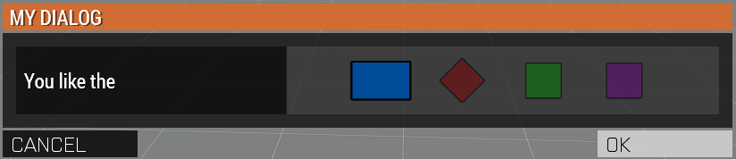
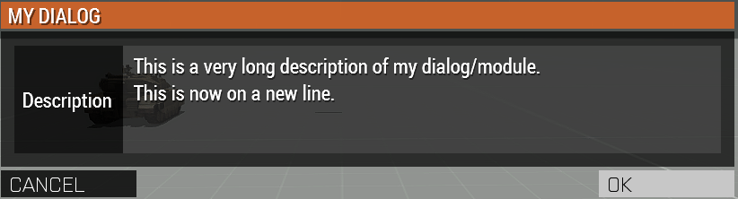

Dynamic Dialog
==============

.. contents::

A good module needs a GUI. For this purpose we provide a simple to use, but powerful dynamic dialog system.

1. Creating the dialog
----------------------

All dynamic dialogs are created using the :code:`achilles_dialog_fnc_create` function.

Here's an example dialog:

.. code-block:: js
    :linenos:

    [
        "My awesome dialog",
        [
            ["CHECKBOX", "My Checkbox", true],
            ["COLOR", "Red Color", [1, 0, 0]],
            ["COLOR", "Faded Green", [0, 1, 0, 0.5]],
            ["SELECT", ["My Select", "With tooltip!"], [
                ["this", "my", true, "values"],
                [
                    ["My basic thing"],
                    ["This", "fancy tooltip", "\A3\Data_F\Flags\Flag_AAF_CO.paa", [0, 1, 0, 1]],
                    ["Something else"],
                    ["Other values"]
                ],
                1
            ]],
            ["TEXT", "Text Input", ["Default string", {params ["_notSanitized"]; _notSanitized}]],
            ["SIDES", "Your allegiance", east],
            ["SLIDER", "Awesomeness", [0, 10, 5, 2]],
            ["BLOCK:YESNO", "Is Demo?", true],
            ["BLOCK:ENABLED", "Internet status"],
            ["BLOCK", "Fine", [1, ["Dining", "Wine", "Arma"]]],
            ["VECTOR", "What's your", [5, 25]],
            ["VECTOR", "Vector, Victor?", [15, 30, -5]]
        ],
        {
            // On success
            systemChat str _this;
            diag_log _this;
        },
        {
            // On cancel
            systemChat str _this;
            diag_log _this;
        }
    ] call achilles_dialog_fnc_create;

Produces the following dialog:

2. Function Arguments
---------------------

The arguments for the actual dialog function is pretty simple, however, it can scale up to suit most of your needs.

+--------------+----------------+-------------+
| Name         | Type           | Default     |
+==============+================+=============+
| Dialog title | :code:`STRING` | Required    |
+--------------+----------------+-------------+
| Controls     | :code:`ARRAY`  | Required    |
+--------------+----------------+-------------+
| On Confirm   | :code:`CODE`   | Required    |
+--------------+----------------+-------------+
| On Cancel    | :code:`CODE`   | :code:`{}`  |
+--------------+----------------+-------------+
| Arguments    | :code:`ANY`    | :code:`[]`  |
+--------------+----------------+-------------+

3. Control Arguments
--------------------

Currently, there are 8 different controls for the dynamic dialog.

+----------------------+---------------------+--------------------------------------------+
| Name                 | Control Type        | Alternative Control Types                  |
+======================+=====================+============================================+
| Checkbox             | :code:`CHECKBOX`    | N/A                                        |
+----------------------+---------------------+--------------------------------------------+
| Color (RGB or RGBA)  | :code:`COLOR`       | N/A                                        |
+----------------------+---------------------+--------------------------------------------+
| Select dropdown      | :code:`SELECT`      | N/A                                        |
+----------------------+---------------------+--------------------------------------------+
| Text                 | :code:`TEXT`        | N/A                                        |
+----------------------+---------------------+--------------------------------------------+
| Side selection       | :code:`SIDES`       | :code:`SIDES:ALL`                          |
+----------------------+---------------------+--------------------------------------------+
| Slider               | :code:`SLIDER`      | N/A                                        |
+----------------------+---------------------+--------------------------------------------+
| Block selection      | :code:`BLOCK`       | :code:`BLOCK:YESNO`, :code:`BLOCK:ENABLED` |
+----------------------+---------------------+--------------------------------------------+
| Vector (2 or 3 axis) | :code:`VECTOR`      | N/A                                        |
+----------------------+---------------------+--------------------------------------------+
| Description          | :code:`DESCRIPTION` | N/A                                        |
+----------------------+---------------------+--------------------------------------------+

3.1. Checkbox control
^^^^^^^^^^^^^^^^^^^^^

The checkbox control is simple to use and doesn't have a lot of options.

**Arguments:**

+----------------------+---------------------------------+-------------------------------------------------------+----------------------------------------------------------------------------------+---------------+
| Name                 | Type                            | Allowed Values                                        | Description                                                                      | Default       |
+======================+=================================+=======================================================+==================================================================================+===============+
| Control              | :code:`STRING`                  | :code:`"CHECKBOX"`                                    | Display a checkbox type control.                                                 | Required      |
+----------------------+---------------------------------+-------------------------------------------------------+----------------------------------------------------------------------------------+---------------+
| Display Name         | :code:`STRING` or :code:`ARRAY` | :code:`STRING` or :code:`["Display Name", "Tooltip"]` | What does the control represent?                                                 | Required      |
+----------------------+---------------------------------+-------------------------------------------------------+----------------------------------------------------------------------------------+---------------+
| Is checked?          | :code:`BOOL`                    | :code:`BOOL`                                          | Should the checkbox be checked?                                                  | :code:`false` |
+----------------------+---------------------------------+-------------------------------------------------------+----------------------------------------------------------------------------------+---------------+
| Force default value? | :code:`BOOL`                    | :code:`BOOL`                                          | Should the given default value be forced? Should we ignore the last saved value? | :code:`false` |
+----------------------+---------------------------------+-------------------------------------------------------+----------------------------------------------------------------------------------+---------------+
| Resource function    | :code:`CODE`                    | :code:`CODE`                                          | Arguments are :code:`[Control Group, Row Index, Default Value, Row Settings]`.   | :code:`{}`    |
+----------------------+---------------------------------+-------------------------------------------------------+----------------------------------------------------------------------------------+---------------+

**Example:**

.. code-block:: js
    :linenos:

    ["My Dialog", [
        [
            "CHECKBOX",
            "Is Achilles?",
            true
        ]
    ], {}] call achilles_dialog_fnc_create;

**Result:**

3.2. Color control
^^^^^^^^^^^^^^^^^^

The color control supports two different types.
RGB *(red-green-blue)* or RGBA *(red-green-blue-alpha)*

There is no specific flag to set.
The dynamic dialog system will automatically set the type depending on the value data array length.

**Arguments:**

+----------------------+---------------------------------+-------------------------------------------------------+----------------------------------------------------------------------------------------------------------------+-------------------+
| Name                 | Type                            | Allowed Values                                        | Description                                                                                                    | Default           |
+======================+=================================+=======================================================+================================================================================================================+===================+
| Control              | :code:`STRING`                  | :code:`"COLOR"`                                       | Display a color type control.                                                                                  | Required          |
+----------------------+---------------------------------+-------------------------------------------------------+----------------------------------------------------------------------------------------------------------------+-------------------+
| Display Name         | :code:`STRING` or :code:`ARRAY` | :code:`STRING` or :code:`["Display Name", "Tooltip"]` | What does the control represent?                                                                               | Required          |
+----------------------+---------------------------------+-------------------------------------------------------+----------------------------------------------------------------------------------------------------------------+-------------------+
| Default color data   | :code:`ARRAY`                   | :code:`[1, 1, 1]` or :code:`[1, 1, 1, 1]`             | What should the default color data be? If 4 arguments provided in the array, then it displays an RGBA control. | :code:`[1, 1, 1]` |
+----------------------+---------------------------------+-------------------------------------------------------+----------------------------------------------------------------------------------------------------------------+-------------------+
| Force default value? | :code:`BOOL`                    | :code:`BOOL`                                          | Should the given default value be forced? Should we ignore the last saved value?                               | :code:`false`     |
+----------------------+---------------------------------+-------------------------------------------------------+----------------------------------------------------------------------------------------------------------------+-------------------+
| Resource function    | :code:`CODE`                    | :code:`CODE`                                          | Arguments are :code:`[Control Group, Row Index, Default Value, Row Settings]`.                                 | :code:`{}`        |
+----------------------+---------------------------------+-------------------------------------------------------+----------------------------------------------------------------------------------------------------------------+-------------------+

3.2.1. Color RGB
""""""""""""""""

**Example:**

.. code-block:: js
    :linenos:

    ["My Dialog", [
        [
            "COLOR",
            "Blue color",
            [0, 0, 1]
        ]
    ], {}] call achilles_dialog_fnc_create;

**Result:**

.. image:: dynamic-dialog-images/3.png
    :alt: RGB control dialog

3.2.2. Color RGBA
"""""""""""""""""

**Example:**

.. code-block:: js
    :linenos:

    ["My Dialog", [
        [
            "COLOR",
            "Faded Dark Purple",
            [0.5, 0, 0.8, 0.25]
        ]
    ], {}] call achilles_dialog_fnc_create;

**Result:**

.. image:: dynamic-dialog-images/4.png
    :alt: RGBA control dialog

3.3. Select dropdown control
^^^^^^^^^^^^^^^^^^^^^^^^^^^^

Select dropdown is a dropdown list control that is very powerful.
It allows for you to set tooltips, images, text colors, etc.

**Arguments:**

+---------------------------+---------------------------------+-------------------------------------------------------+----------------------------------------------------------------------------------+---------------+
| Name                      | Type                            | Allowed Values                                        | Description                                                                      | Default       |
+===========================+=================================+=======================================================+==================================================================================+===============+
| Control                   | :code:`STRING`                  | :code:`"SELECT"`                                      | Display a select type control.                                                   | Required      |
+---------------------------+---------------------------------+-------------------------------------------------------+----------------------------------------------------------------------------------+---------------+
| Display Name              | :code:`STRING` or :code:`ARRAY` | :code:`STRING` or :code:`["Display Name", "Tooltip"]` | What does the control represent?                                                 | Required      |
+---------------------------+---------------------------------+-------------------------------------------------------+----------------------------------------------------------------------------------+---------------+
| Array of selectable items | :code:`ARRAY`                   | See "`3.3.1. Allowed values`_"                        | Array of selectable elements that will be displayed to the user.                 | Required      |
+---------------------------+---------------------------------+-------------------------------------------------------+----------------------------------------------------------------------------------+---------------+
| Force default value?      | :code:`BOOL`                    | :code:`BOOL`                                          | Should the given default value be forced? Should we ignore the last saved value? | :code:`false` |
+---------------------------+---------------------------------+-------------------------------------------------------+----------------------------------------------------------------------------------+---------------+
| Resource function         | :code:`CODE`                    | :code:`CODE`                                          | Arguments are :code:`[Control Group, Row Index, Default Value, Row Settings]`.   | :code:`{}`    |
+---------------------------+---------------------------------+-------------------------------------------------------+----------------------------------------------------------------------------------+---------------+

**Example:**

.. code-block:: js
    :linenos:

    ["My Dialog", [
        [
            "SELECT",
            [
                "What should we eat tonight?",
                "Pick something delicious!"
            ],
            [
                [
                    ["Flour", "Cheese", "Magic"], "Find it!", false
                ],
                [
                    ["Pizza", "Delicious?"],
                    ["An apple", "Easy!", "\A3\Data_F\Flags\Flag_green_CO.paa", [0, 1, 0, 1]],
                    ["Steak"]
                ],
                1
            ]
        ]
    ], {}] call achilles_dialog_fnc_create;

**Result:**

3.3.1. Allowed values
"""""""""""""""""""""

+-------------------------+---------------------------------------------------------------------+-----------+---------------------------------------------------------------------------------------------------------------------------------+
| Name                    | Type                                                                | Default   | Description                                                                                                                     |
+=========================+=====================================================================+===========+=================================================================================================================================+
| Value array of anything | :code:`ARRAY`                                                       | Required  | Once the user selects an item from the dialog and closes it (OK or Cancel) the selected value will be returned from this array. |
+-------------------------+---------------------------------------------------------------------+-----------+---------------------------------------------------------------------------------------------------------------------------------+
| Array of display values | :code:`ARRAY` (See `display arguments <arguments-for-display_>`_)   | Required  | An array of values that will be displayed to the user.                                                                          |
+-------------------------+---------------------------------------------------------------------+-----------+---------------------------------------------------------------------------------------------------------------------------------+
| Default selected value  | :code:`SCALAR`                                                      | :code:`0` | Allows to select which element will be the default selected one.                                                                |
+-------------------------+---------------------------------------------------------------------+-----------+---------------------------------------------------------------------------------------------------------------------------------+

.. _arguments-for-display:

**Display text arguments:**

Below is a table with arguments for the display content of one element.

+--------------+----------------+----------------------+--------------------------------------------------------------------------+
| Name         | Type           | Default              | Description                                                              |
+==============+================+======================+==========================================================================+
| Display Name | :code:`STRING` | Required             | Dropdown item name to be displayed to the user.                          |
+--------------+----------------+----------------------+--------------------------------------------------------------------------+
| Tooltip Name | :code:`STRING` | :code:`""`           | Tooltip to display when the user moves his mouse over the dropdown item. |
+--------------+----------------+----------------------+--------------------------------------------------------------------------+
| Picture Path | :code:`STRING` | :code:`""`           | Path to the image to be displayed to the left of the display name.       |
+--------------+----------------+----------------------+--------------------------------------------------------------------------+
| Text Color   | :code:`ARRAY`  | :code:`[1, 1, 1, 1]` | The text color for that one dropdown item. **Requires color RGBA**.      |
+--------------+----------------+----------------------+--------------------------------------------------------------------------+

3.4. Text control
^^^^^^^^^^^^^^^^^

The text control is a simple text box that allows users to input data into the box.

**Arguments:**

+---------------------------+---------------------------------+-------------------------------------------------------+----------------------------------------------------------------------------------+---------------+
| Name                      | Type                            | Allowed Values                                        | Description                                                                      | Default       |
+===========================+=================================+=======================================================+==================================================================================+===============+
| Control                   | :code:`STRING`                  | :code:`"TEXT"`                                        | Display a text type control.                                                     | Required      |
+---------------------------+---------------------------------+-------------------------------------------------------+----------------------------------------------------------------------------------+---------------+
| Display Name              | :code:`STRING` or :code:`ARRAY` | :code:`STRING` or :code:`["Display Name", "Tooltip"]` | What does the control represent?                                                 | Required      |
+---------------------------+---------------------------------+-------------------------------------------------------+----------------------------------------------------------------------------------+---------------+
| Default string to display | :code:`STRING` or :code:`ARRAY` | :code:`STRING` or :code:`["Default Text", {_this}]`   | The default text what should be displayed when the control is first displayed.   | Required      |
+---------------------------+---------------------------------+-------------------------------------------------------+----------------------------------------------------------------------------------+---------------+
| Force default value?      | :code:`BOOL`                    | :code:`BOOL`                                          | Should the given default value be forced? Should we ignore the last saved value? | :code:`false` |
+---------------------------+---------------------------------+-------------------------------------------------------+----------------------------------------------------------------------------------+---------------+
| Resource function         | :code:`CODE`                    | :code:`CODE`                                          | Arguments are :code:`[Control Group, Row Index, Default Value, Row Settings]`.   | :code:`{}`    |
+---------------------------+---------------------------------+-------------------------------------------------------+----------------------------------------------------------------------------------+---------------+

Default text has two options:

- Any string.
- Array of default text to display and the sanitize function or code to call.

This sanitize function receives the text the user is currently entering in :code:`_this` variable.
This function is called on each key press in the unscheduled enviornment.

.. warning::
    As this function is called on each key press, it has to be very quick.

**Example:**

.. code-block:: js
    :linenos:

    ["My Dialog", [
        [
            "TEXT",
            "What's the year?",
            "20"
        ]
    ], {}] call achilles_dialog_fnc_create;

**Result:**

3.5. Side select control
^^^^^^^^^^^^^^^^^^^^^^^^

A simple side selector control which allows the user to select between the 4 main sides.

- BLUFOR
- OPFOR
- Independent
- Civilian

An optional 5th side can be added: Logic side (:code:`sideLogic`).
This is achieved using the secondary control :code:`SIDES:ALL`.

.. warning::
    It's highly recommended to provide a default value for the side.
    If not done so, then if the user doesn't select anything when prompted to, will result in a :code:`nil` value in the dialog result.

**Arguments:**

+----------------------------------+---------------------------------+-------------------------------------------------------+----------------------------------------------------------------------------------+---------------+
| Name                             | Type                            | Allowed Values                                        | Description                                                                      | Default       |
+==================================+=================================+=======================================================+==================================================================================+===============+
| Control                          | :code:`STRING`                  | :code:`"SIDES"` or :code:`"SIDES:ALL"`                | Display a side type control.                                                     | Required      |
+----------------------------------+---------------------------------+-------------------------------------------------------+----------------------------------------------------------------------------------+---------------+
| Display Name                     | :code:`STRING` or :code:`ARRAY` | :code:`STRING` or :code:`["Display Name", "Tooltip"]` | What does the control represent?                                                 | Required      |
+----------------------------------+---------------------------------+-------------------------------------------------------+----------------------------------------------------------------------------------+---------------+
| Default side to show as selected | :code:`SIDE`                    | :code:`SIDE`                                          | The default side that should be selected.                                        | :code:`nil`   |
+----------------------------------+---------------------------------+-------------------------------------------------------+----------------------------------------------------------------------------------+---------------+
| Force default value?             | :code:`BOOL`                    | :code:`BOOL`                                          | Should the given default value be forced? Should we ignore the last saved value? | :code:`false` |
+----------------------------------+---------------------------------+-------------------------------------------------------+----------------------------------------------------------------------------------+---------------+
| Resource function                | :code:`CODE`                    | :code:`CODE`                                          | Arguments are :code:`[Control Group, Row Index, Default Value, Row Settings]`.   | :code:`{}`    |
+----------------------------------+---------------------------------+-------------------------------------------------------+----------------------------------------------------------------------------------+---------------+

**Example:**

.. code-block:: js
    :linenos:

    ["My Dialog", [
        [
            "SIDES",
            "You like the",
            west
        ]
    ], {}] call achilles_dialog_fnc_create;

**Result:**

3.6. Slider control
^^^^^^^^^^^^^^^^^^^

The slider control is a simple slider that allows you to select a value in the defined range.

**Arguments:**

+--------------------------+---------------------------------+-------------------------------------------------------+------------------------------------------------------------------------------------------------------------------------------+----------------------+
| Name                     | Type                            | Allowed Values                                        | Description                                                                                                                  | Default              |
+==========================+=================================+=======================================================+==============================================================================================================================+======================+
| Control                  | :code:`STRING`                  | :code:`"SLIDER"`                                      | Display a slider type control.                                                                                               | Required             |
+--------------------------+---------------------------------+-------------------------------------------------------+------------------------------------------------------------------------------------------------------------------------------+----------------------+
| Display Name             | :code:`STRING` or :code:`ARRAY` | :code:`STRING` or :code:`["Display Name", "Tooltip"]` | What does the control represent?                                                                                             | Required             |
+--------------------------+---------------------------------+-------------------------------------------------------+------------------------------------------------------------------------------------------------------------------------------+----------------------+
| Array of slider settings | :code:`ARRAY`                   | :code:`[min, max, default, decimals]`                 | Array of the minimum and maximum allowed values of the slider, the default value to set the slider at and the decimal point. | :code:`[0, 1, 0, 2]` |
+--------------------------+---------------------------------+-------------------------------------------------------+------------------------------------------------------------------------------------------------------------------------------+----------------------+
| Force default value?     | :code:`BOOL`                    | :code:`BOOL`                                          | Should the given default value be forced? Should we ignore the last saved value?                                             | :code:`false`        |
+--------------------------+---------------------------------+-------------------------------------------------------+------------------------------------------------------------------------------------------------------------------------------+----------------------+
| Resource function        | :code:`CODE`                    | :code:`CODE`                                          | Arguments are :code:`[Control Group, Row Index, Default Value, Row Settings]`.                                               | :code:`{}`           |
+--------------------------+---------------------------------+-------------------------------------------------------+------------------------------------------------------------------------------------------------------------------------------+----------------------+

**Example:**

.. code-block:: js
    :linenos:

    ["My Dialog", [
        [
            "SLIDER",
            "Distance to Altis",
            [
                0,
                100,
                25,
                1
            ]
        ]
    ], {}] call achilles_dialog_fnc_create;

**Result:**

3.7. Block selection control
^^^^^^^^^^^^^^^^^^^^^^^^^^^^

The block selection is a way to select something without having to go into a select dropdown or something that the simple checkbox can't handle.

**Arguments:**

+--------------------------+---------------------------------+-------------------------------------------------------------+----------------------------------------------------------------------------------------------------------------------------------+----------------------+
| Name                     | Type                            | Allowed Values                                              | Description                                                                                                                      | Default              |
+==========================+=================================+=============================================================+==================================================================================================================================+======================+
| Control                  | :code:`STRING`                  | :code:`"BLOCK"`, :code:`BLOCK:YESNO`, :code:`BLOCK:ENABLED` | Display a block select type control. Allows to quickly use Yes/No or Enabled/Disabled type questions.                            | Required             |
+--------------------------+---------------------------------+-------------------------------------------------------------+----------------------------------------------------------------------------------------------------------------------------------+----------------------+
| Display Name             | :code:`STRING` or :code:`ARRAY` | :code:`STRING` or :code:`["Display Name", "Tooltip"]`       | What does the control represent?                                                                                                 | Required             |
+--------------------------+---------------------------------+-------------------------------------------------------------+----------------------------------------------------------------------------------------------------------------------------------+----------------------+
| Array of block questions | :code:`ARRAY`                   | See "`3.7.1. Allowed values`_"                              | An array of data to be displayed to the user (not required if using the :code:`:YESNO` or :code:`:ENABLED` secondary controls.)  | :code:`[0, 1, 0, 2]` |
+--------------------------+---------------------------------+-------------------------------------------------------------+----------------------------------------------------------------------------------------------------------------------------------+----------------------+
| Force default value?     | :code:`BOOL`                    | :code:`BOOL`                                                | Should the given default value be forced? Should we ignore the last saved value?                                                 | :code:`false`        |
+--------------------------+---------------------------------+-------------------------------------------------------------+----------------------------------------------------------------------------------------------------------------------------------+----------------------+
| Resource function        | :code:`CODE`                    | :code:`CODE`                                                | Arguments are :code:`[Control Group, Row Index, Default Value, Row Settings]`.                                                   | :code:`{}`           |
+--------------------------+---------------------------------+-------------------------------------------------------------+----------------------------------------------------------------------------------------------------------------------------------+----------------------+

3.7.1. Allowed values
"""""""""""""""""""""

.. note:: If using any of the secondary control types, then you do not have to add the questions.

.. note:: The maximum amount of items to select in the block control that can be added is 5.

To select the default value you can use the indexes of the question (0, 1, etc.) but if you only have 2 questions, then you can use a boolean.

If you are using the secondary control then you can also specify which control should be the default selected one.
You can use a boolean to select the default question.
:code:`false` would be on the left and :code:`true` would be on the right.

**Examples:**

.. code-block:: js
    :linenos:

    ["My Dialog", [
        [
            "BLOCK:YESNO",
            "Taras Kul",
            [true]
        ]
    ], {}] call achilles_dialog_fnc_create;

.. code-block:: js
    :linenos:

    ["My Dialog", [
        [
            "BLOCK",
            "She's",
            [
                2,
                [
                    "Old",
                    "Cool",
                    "On Fire",
                    "Boring",
                    "Other"
                ]
            ]
        ]
    ], {}] call achilles_dialog_fnc_create;

**Results:**

3.8. Vector control
^^^^^^^^^^^^^^^^^^^

The vector control works very similarly to the `color control <3.2. Color control_>`_.
As in it's dependent on the number of elements provided to display the number of axes you want.

If you provide 2 elements then you will only see the option to enter the `X` and `Y` axes, but if you provide 3 then the `Z` axis is added too.

**Arguments:**

+----------------------+---------------------------------+-------------------------------------------------------+----------------------------------------------------------------------------------+----------------+
| Name                 | Type                            | Allowed Values                                        | Description                                                                      | Default        |
+======================+=================================+=======================================================+==================================================================================+================+
| Control              | :code:`STRING`                  | :code:`"VECTOR"`                                      | Display a vector type control.                                                   | Required       |
+----------------------+---------------------------------+-------------------------------------------------------+----------------------------------------------------------------------------------+----------------+
| Display Name         | :code:`STRING` or :code:`ARRAY` | :code:`STRING` or :code:`["Display Name", "Tooltip"]` | What does the control represent?                                                 | Required       |
+----------------------+---------------------------------+-------------------------------------------------------+----------------------------------------------------------------------------------+----------------+
| Array of vector axes | :code:`ARRAY`                   | :code:`[0, 0]` or :code:`[0, 0, 0]`                   | The number of elements dictates if the `Z` axis should also be displayed.        | :code:`[0, 0]` |
+----------------------+---------------------------------+-------------------------------------------------------+----------------------------------------------------------------------------------+----------------+
| Force default value? | :code:`BOOL`                    | :code:`BOOL`                                          | Should the given default value be forced? Should we ignore the last saved value? | :code:`false`  |
+----------------------+---------------------------------+-------------------------------------------------------+----------------------------------------------------------------------------------+----------------+
| Resource function    | :code:`CODE`                    | :code:`CODE`                                          | Arguments are :code:`[Control Group, Row Index, Default Value, Row Settings]`.   | :code:`{}`     |
+----------------------+---------------------------------+-------------------------------------------------------+----------------------------------------------------------------------------------+----------------+

**Example:**

.. code-block:: js
    :linenos:

    ["My Dialog", [
        [
            "VECTOR",
            "Universe Length",
            [-5034, 1000, 3]
        ]
    ], {}] call achilles_dialog_fnc_create;

**Result:**

3.9. Description control
^^^^^^^^^^^^^^^^^^^^^^^^

The description control is designed to display a multi-line text message to the user to describe anything you like.

If you want to display a multi-line message then you have to append the new line character (:code:`\n`) to your string of text.

.. note::
    This control does **not** return it's value when cancelling or confirming the dialog.

**Arguments:**

+----------------------+---------------------------------+-------------------------------------------------------+---------------------------------------------------------------------------------------------------+---------------+
| Name                 | Type                            | Allowed Values                                        | Description                                                                                       | Default       |
+======================+=================================+=======================================================+===================================================================================================+===============+
| Control              | :code:`STRING`                  | :code:`"DESCRIPTION"`                                 | Display a description type control.                                                               | Required      |
+----------------------+---------------------------------+-------------------------------------------------------+---------------------------------------------------------------------------------------------------+---------------+
| Display Name         | :code:`STRING` or :code:`ARRAY` | :code:`STRING` or :code:`["Display Name", "Tooltip"]` | What does the control represent?                                                                  | Required      |
+----------------------+---------------------------------+-------------------------------------------------------+---------------------------------------------------------------------------------------------------+---------------+
| Text to display      | :code:`STRING`                  | :code:`STRING`                                        | This text will be displayed to the user. To add a new line use the :code:`\n` character.          | Required      |
+----------------------+---------------------------------+-------------------------------------------------------+---------------------------------------------------------------------------------------------------+---------------+
| Resource function    | :code:`CODE`                    | :code:`CODE`                                          | Arguments are :code:`[Control Group, Row Index, Default Value, Row Settings]`.                    | :code:`{}`    |
+----------------------+---------------------------------+-------------------------------------------------------+---------------------------------------------------------------------------------------------------+---------------+

**Example:**

.. code-block:: js
    :linenos:

    ["My Dialog", [
        [
            "DESCRIPTION",
            "Description",
            "This is a very long description of my dialog/module.\nThis is now on a new line."
        ]
    ], {}] call achilles_dialog_fnc_create;

**Result:**

3.10. Owner control
^^^^^^^^^^^^^^^^^^

The owner control (based on the same one from vanilla Arma 3) is a tab based selection which allows you to select playable entities.
It provides 3 master tabs, side - group - player.

**Arguments:**

+----------------------+-------------------------------------------------+-------------------------------------------------------+----------------------------------------------------------------------------------+----------------+
| Name                 | Type                                            | Allowed Values                                        | Description                                                                      | Default        |
+======================+=================================================+=======================================================+==================================================================================+================+
| Control              | :code:`STRING`                                  | :code:`"OWNERS"`                                      | Display the owners type control.                                                 | Required       |
+----------------------+-------------------------------------------------+-------------------------------------------------------+----------------------------------------------------------------------------------+----------------+
| Display Name         | :code:`STRING` or :code:`ARRAY`                 | :code:`STRING` or :code:`["Display Name", "Tooltip"]` | What does the control represent?                                                 | Required       |
+----------------------+-------------------------------------------------+-------------------------------------------------------+----------------------------------------------------------------------------------+----------------+
| Default value        | :code:`SIDE` or :code:`GROUP` or :code:`OBJECT` | :code:`SIDE` or :code:`GROUP` or :code:`OBJECT`       | Playable unit side, group or the unit itself to select as default.               | :code:`west`   |
+----------------------+-------------------------------------------------+-------------------------------------------------------+----------------------------------------------------------------------------------+----------------+
| Force default value? | :code:`BOOL`                                    | :code:`BOOL`                                          | Should the given default value be forced? Should we ignore the last saved value? | :code:`false`  |
+----------------------+-------------------------------------------------+-------------------------------------------------------+----------------------------------------------------------------------------------+----------------+
| Resource function    | :code:`CODE`                                    | :code:`CODE`                                          | Arguments are :code:`[Control Group, Row Index, Default Value, Row Settings]`.   | :code:`{}`     |
+----------------------+-------------------------------------------------+-------------------------------------------------------+----------------------------------------------------------------------------------+----------------+

**Example:**

.. code-block:: js
    :linenos:

    ["My Dialog", [
        [
            "OWNERS",
            "Owners",
            switchableUnits select 1
        ]
    ], {}] call achilles_dialog_fnc_create;

**Result:**

4. On Confirm and On Cancel
---------------------------

On confirm and on cancel are two different scripts that will be executed depending on the following conditions:

- If the user presses the OK or Cancel buttons.
- If the user presses the Escape key.

When these scripts are called, data is passed in the :code:`_this` variable.

+---------------------------------------------------------+---------------+------------+
| Name                                                    | Type          | Default    |
+=========================================================+===============+============+
| Array of selected values                                | :code:`ARRAY` | N/A        |
+---------------------------------------------------------+---------------+------------+
| Array of arguments (provided when calling the function) | :code:`ARRAY` | :code:`[]` |
+---------------------------------------------------------+---------------+------------+
