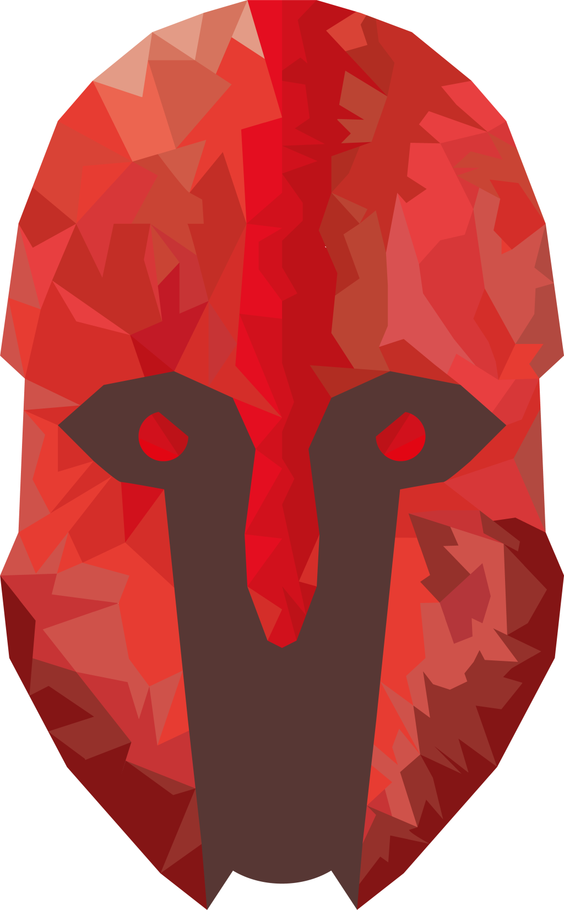

Achilles: Zeus on Steroids
==========================

.. warning::
    The current documentation is still a work-in-progress and does not reflect the current release version of Achilles.

`Achilles <https://github.com/ArmaAchilles/Achilles>`_ is a gameplay modification for Arma 3. It expands the Zeus real-time editor with many new additions as well as provides bug fixes.

Achilles started as an expansion to `Ares <https://github.com/astruyk/Ares>`_ mod, which was created by `Anton Struyk <https://github.com/astruyk>`_. Achilles became the *de facto* successor to Ares at the point the latter was no longer updated. Achilles has already grown into a *splendid* project, but new additions are still to come!

Tons of new modules
    Achilles provides new and exciting modules to spice up your gameplay and provide new experiences for all players.

Lots of customizability
    Using the powerful CBA settings framework, we provide stunning amounts of customizability for the Zeus interface to tailor it to just you.

Tried and tested
    As Achilles grew from Ares in 2016, it has accumulated over 250 000 unique downloads and come to a more and more polished product that has received many transformations over the years to make it even more splendid.

Open source
    Achilles is open source and has been so from the earliest of days. We are actively supporting the introduction of new contributions.

First steps
-----------

Are you looking to create a new world of experiences for your multiplayer missions or just looking to have fun? Learn how to install Achilles and get playing with the revamped Zeus.

- **Getting started**:
  :doc:`Installing Achilles <intro/installing-achilles>` |
  :doc:`Preparing a mission with Achilles <intro/mission-setup>`

.. toctree::
    :maxdepth: 2
    :hidden:
    :caption: First Steps

    intro/installing-achilles
    intro/mission-setup

.. _user-docs:

.. toctree::
   :maxdepth: 2
   :caption: User Documentation

   user/features
   user/support
   user/faq

.. _feature-docs:

.. toctree::
    :maxdepth: 2
    :glob:
    :caption: Feature Documentation

    features/modules
    features/dynamic-dialog
    features/attribute-windows
    features/waypoints
    features/hotkeys
    features/customizations
    features/ui-changes

.. _dev-docs:

.. toctree::
    :maxdepth: 1
    :caption: Developer Documentation

    development/changelog
    development/install
    development/architecture
    development/docs
    development/code-guidelines
    development/localization

.. _about-docs:

.. toctree::
    :maxdepth: 1
    :caption: About Achilles

    about/contribute
    about/roadmap
    about/team
