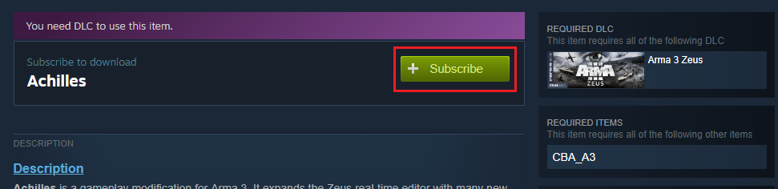
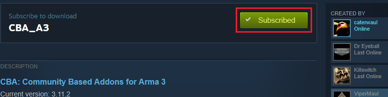
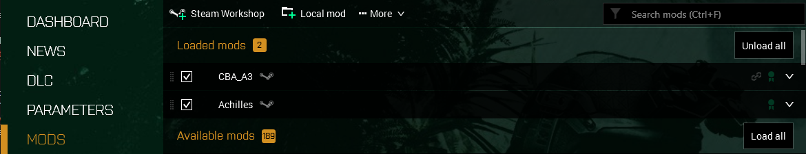
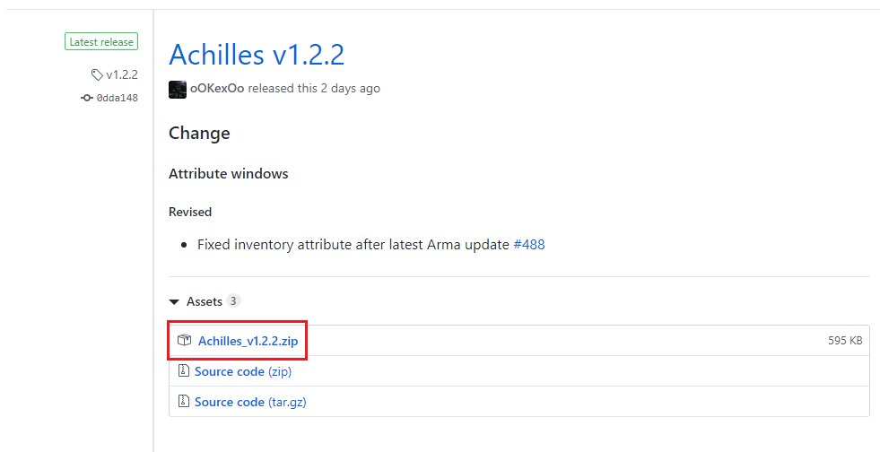
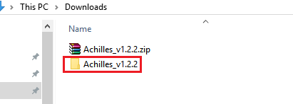
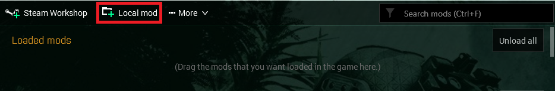

Installing Achilles
===================

.. contents::

1. Installing from Steam Workshop
---------------------------------
Installing `Achilles <https://github.com/ArmaAchilles/Achilles>`_ from its `Steam Workshop <https://steamcommunity.com/sharedfiles/filedetails/?id=723217262>`_ page is a fairly easy task. You will need to install two mods, Achilles itself, and its dependency, `CBA_A3 <https://steamcommunity.com/workshop/filedetails/?id=450814997>`_.

1.1. Subscribe to Achilles on Steam
^^^^^^^^^^^^^^^^^^^^^^^^^^^^^^^^^^^

*This will download and automatically install the mod for you.*
Download the mod off Steam `here <https://steamcommunity.com/sharedfiles/filedetails/?id=723217262>`_.

1.2. Subscribe to CBA_A3 if prompted
^^^^^^^^^^^^^^^^^^^^^^^^^^^^^^^^^^^^
Ensure you download `CBA_A3 <https://steamcommunity.com/workshop/filedetails/?id=450814997>`_ from the Steam Workshop as well.

*Make sure you subscribe to CBA_A3, or Achilles won't work properly!*

1.3. Running the mods
^^^^^^^^^^^^^^^^^^^^^
Since Steam handled the installation automatically, you should now be able to see the new mods in your **ArmA 3 Launcher** when you start it, and be able to load them, as so.

*You can now play the game and enjoy your new Zeus experience.*
Struggling to figure out how to get in and really experience Zeus? See our mission setup guide.

:doc:`Preparing a mission with Achilles <intro/mission-setup>`

2. Installing from GitHub
---------------------------------
Installing `Achilles <https://github.com/ArmaAchilles/Achilles>`_ from GitHub is a slightly more complicated process. If you are not used to GitHub, or prefer an easier installation, we recommend you use the Steam installation guide. If you would rather download the mod from GitHub from whatever reason however, please read on.

2.1. Open the Achilles Releases on GitHub
^^^^^^^^^^^^^^^^^^^^^^^^^^^^^^^^^^
You can find all current and old releases of Achilles `here <https://github.com/ArmaAchilles/Achilles/releases>`_.

*Go ahead and download the latest release. If, for some reason, you want an older version, you can do that too, just download the zip.*

2.2. Unrar the mod .zip
^^^^^^^^^^^^^^^^^^^^^^^

*Unrar the mod, so you get a folder like so. Open the folder, and you will find an @Achilles folder.*

ArmA 3's launcher is configured to load local mods as well, as you might have noticed. Place the **@Achilles** folder somewhere safe. Most people recommend inside your ArmA 3 installation, but anywhere is fine.

2.3. Add the mod folder as a local mod
^^^^^^^^^^^^^^^^^^^^^^^^^^^^^^^^^^^^^^

*Click this option, navigate to where you placed the @Achilles folder, and voila, you added the mod into your launcher!*

.. warning::
   Remember that if you will need to download CBA_A3, Achilles' dependency, a similar way to ensure the mod works!

**Download CBA_A3 off their GitHub.**

`CBATeam's Releases <https://github.com/CBATeam/CBA_A3/releases>`_

Thanks for reading, and have fun Zeusing!
